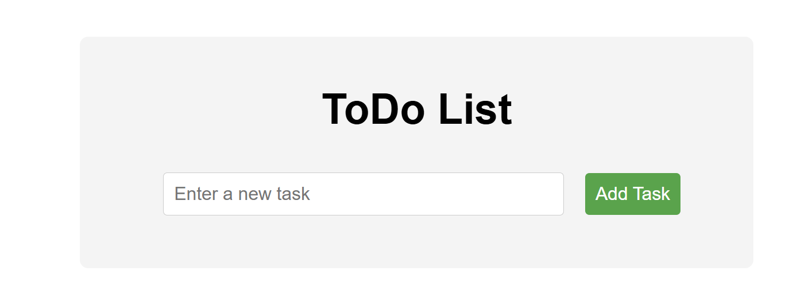
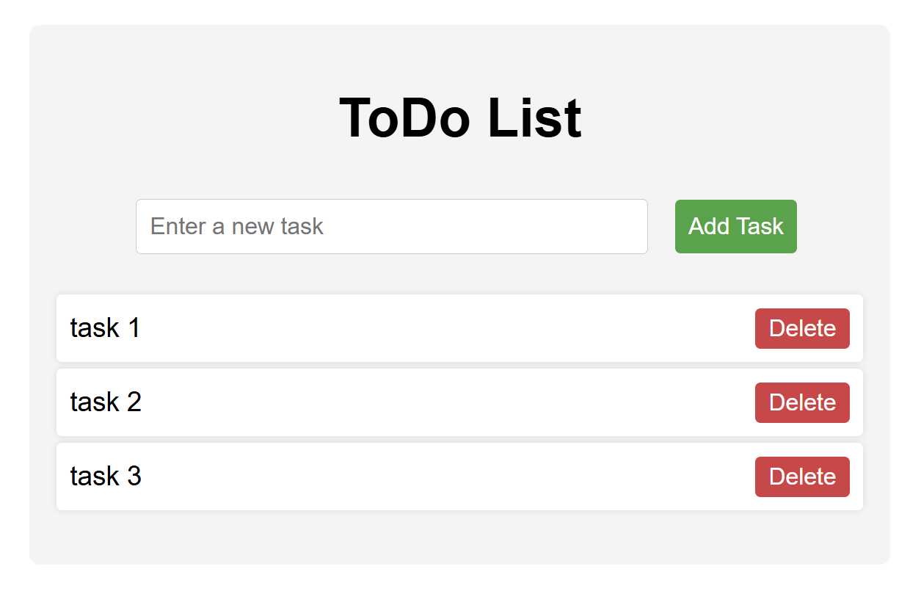

# Getting Started with Create React App

# Preliminary
Install the react-dom and web-vitals as follows:

>npm install react-dom

>npm install web-vitals

Then start the project by:

>npm start

# Input
The project start with the empty task list. Enter the new task and click "Add Task" will append the task list. Each task can be deleted by clicking the button "Delete".

# Process
There are two .js files serving functionally in the project. The function of each of them is described as follows:
- ToDoItem.js
    - task (a string) → The text of the to-do item.
    - index (a number) → The position of the task in the list.
    - handleDeleteTask (a function) → A function that deletes the task when called.
    
    Inside the component, it displays the task inside an &lt;li&gt; (list item). A &lt;button&gt; is included that triggers handleDeleteTask(index), which removes the task when clicked.

- ToDoList.js receives two props:
    - todos (an array) → A list of to-do items (e.g., ["Buy groceries", "Do laundry"]).
    - setTodos (a function) → A state updater function to modify the list.
    
    Inside the component:
        - The handleDeleteTask function removes an item from todos based on its index.
        - The list is displayed using <ul>, and each item is mapped to a ToDoItem component.
        - Each ToDoItem gets:
            - The task (text of the item).
            - The index (its position in the list).
            - The handleDeleteTask function.

# Output
- Add task
    - Enter the task description, then click "Add Task" to append it to the list. 
- Delete task
    - Each task can be removed by clicking the bottom "Delete".
 