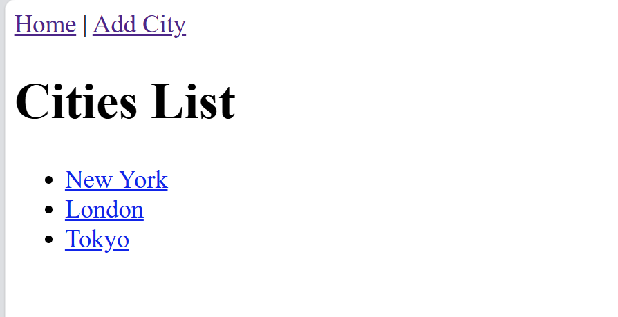
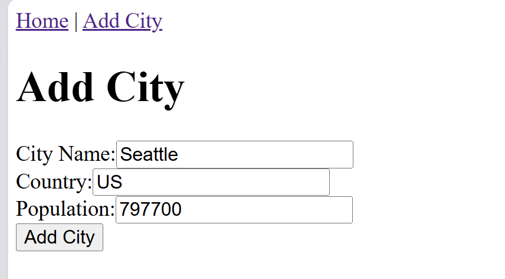
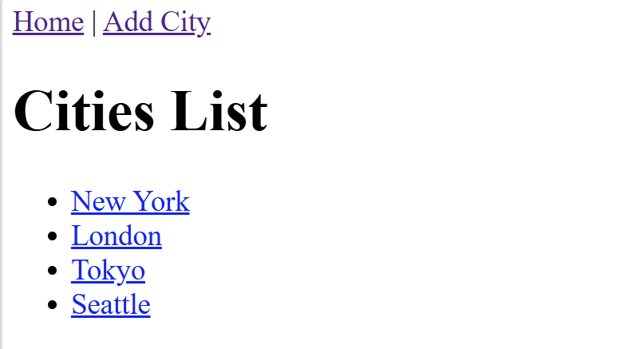

# Preliminary
Install the package "react-scrips" as follow:

>npm install react-scripts

Then start the project by:

> npm start

# Input

The project mainland has three main component:
- Home
- Add City
- City List -> 3 default cities are displayed.

# Process
There are 3 main functional .js files in the project:
- CitiesList.js -> responsible for displaying a list of cities.
    - Props: It receives a cities prop, which is an array of city objects.
    - Rendering the Cities List:
        - It renders a heading (&lt;h1&gt;) with the title "Cities List".
        - It then maps over the cities array and generates a list of city names wrapped in &lt;li&gt; elements.
        - Each city name is wrapped in a &lt;Link&gt; component, which is a part of the react-router-dom library. The city.id is used in the URL to uniquely identify each city.
    - Key Prop: Each &lt;li&gt; element has a unique key prop (city.id), which is required for rendering lists in React.

- CityDetails.js -> responsible for displaying the detailed information of a specific city when the user clicks on a city name from the list.
    - Props: It also receives a cities prop, which is an array of city objects.
    - Getting the City ID: The useParams() hook from react-router-dom is used to access the cityId parameter from the URL (the part after /city/ in the URL).
    - Finding the City: The component then uses find() to look for the city object in the cities array whose id matches the cityId from the URL.
    - Displaying City Details: If the city is found, it renders the city's name, country, and population in a simple layout. The city data is rendered inside &lt;h1&gt; for the name, and &lt;p&gt; tags for country and population.

- AddCity.js
    - The component uses React's useState hook to manage the state for the inputs.
    - navigate: This is a hook from react-router-dom that allows you to programmatically navigate between pages. In this case, it is used to redirect the user back to the cities list ('/') after successfully adding a city.
    - handleSubmit function is triggered when the form is submitted.
    - The AddCity Component main function is to allow the user to input the name, country, and population of a city and then add that city to the list (through the onAddCity callback passed as a prop).

# Output
- The project's display three default cities, i.e, New York, London, and Tokyo. 
- Click the button "Add City" allows user to add new city when providing "City Name", "Country", and "Population". The new city will display at mainland after click the button "Add City"

